## 1. Instalasi Git

1. Double click pada file yang di-download. Akan dimunculkan lisensi. Klik **Next** untuk lanjut.

![01]

2. pilih lokasi instalasi

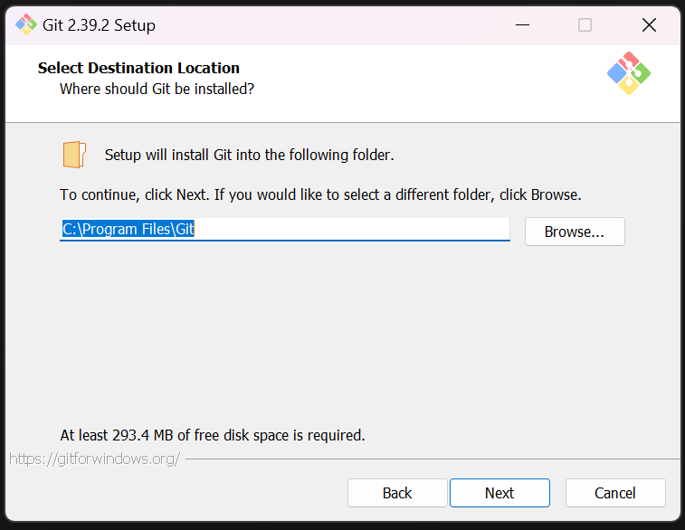

3. Pilih komponen. Tidak perlu diubah-ubah, sesuai dengan default saja. Klik pada **Next**.

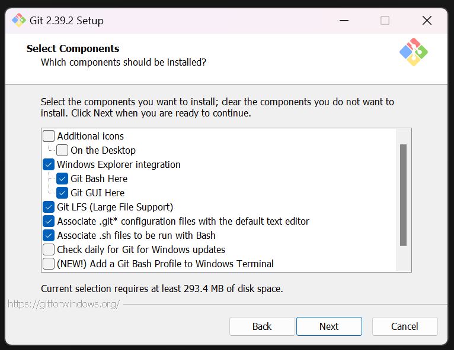

4. Mengisi shortcut untuk menu Start. Gunakan default (Git), ganti jika ingin mengganti - misalnya Git VCS.

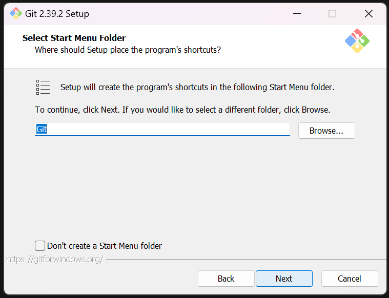

5. Pilih editor yang akan digunakan bersama dengan Git. Pada pilihan ini, digunakan Notepad++.

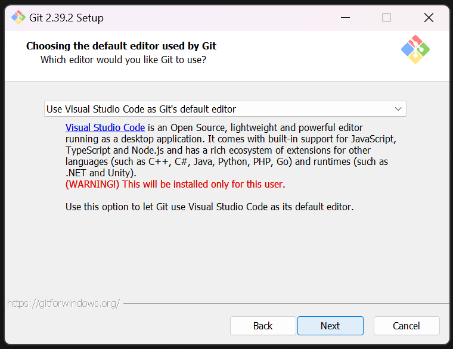

6. Pada saat instalasi, Git menyediakan akses git melalui Bash maupun command prompt. Pilih pilihan kedua supaya bisa menggunakan dari dua antarmuka tersebut. Bash adalah shell di Linux. Dengan menggunakan bash di Windows, pekerjaan di command line Windows bisa dilakukan menggunakan bash - termasuk ekskusi dari Git.

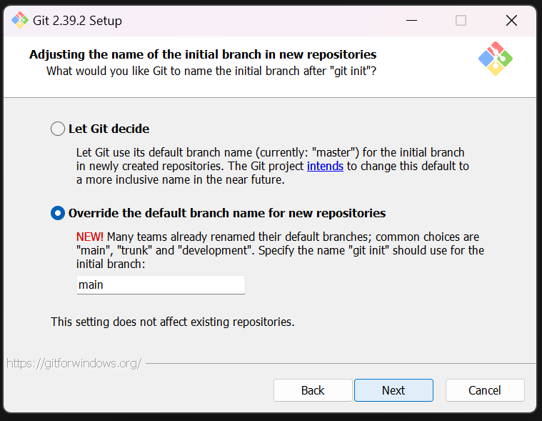

7. Pilih OpenSSL untuk HTTPS. Git menggunakan https untuk akes ke repo GitHub atau repo-repo lain (GitLab, Assembla).

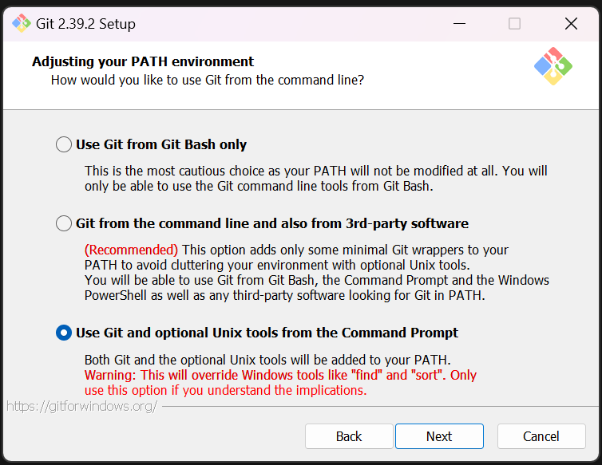

8. Pilih pilihan pertama untuk konversi akhir baris (CR-LF).

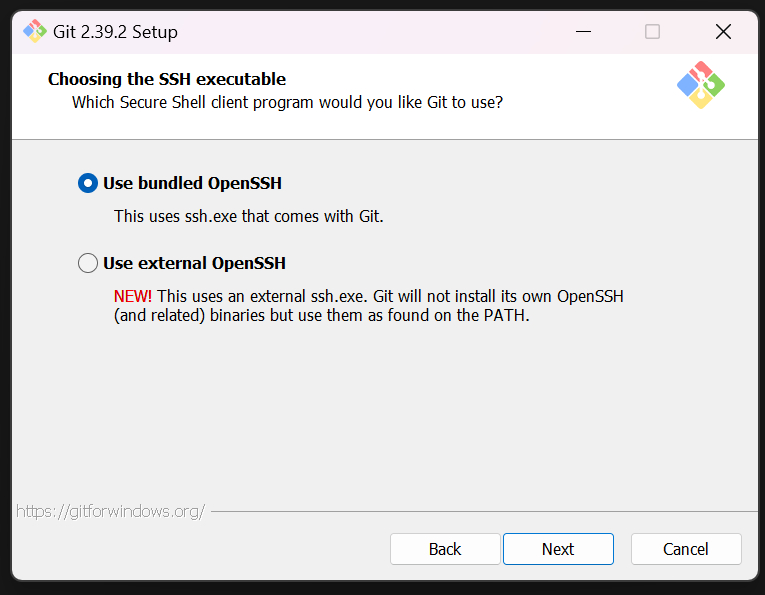

9. Pilih PuTTY untuk terminal yang digunakan untuk mengakses Git Bash.

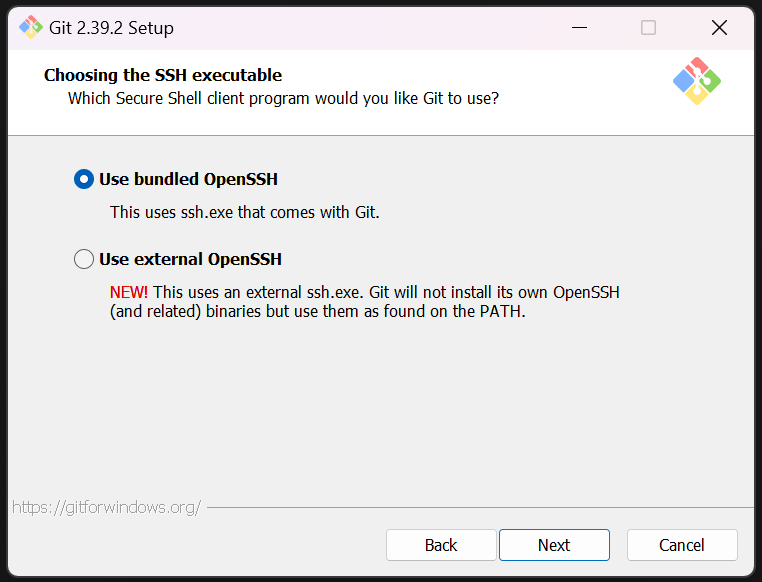

10. Untuk opsi ekstra, pilih serta aktifkan 1 dan 2.

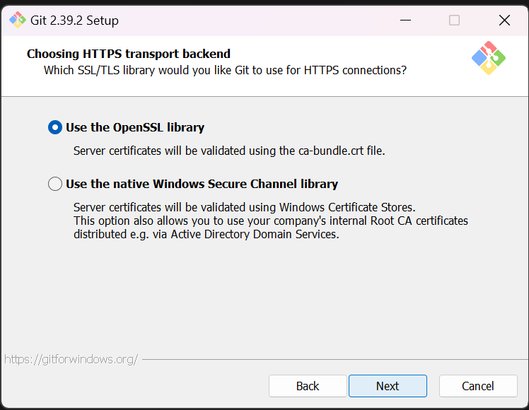

11. Setelah itu proses instalasi akan dilakukan.

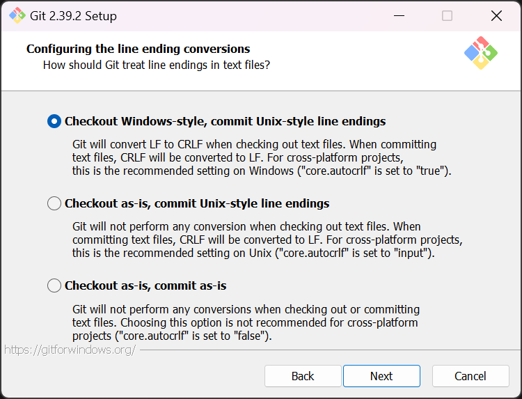

12. Jika selesai akan muncul dialog pemberitahuan. Klik pada **Finish**.

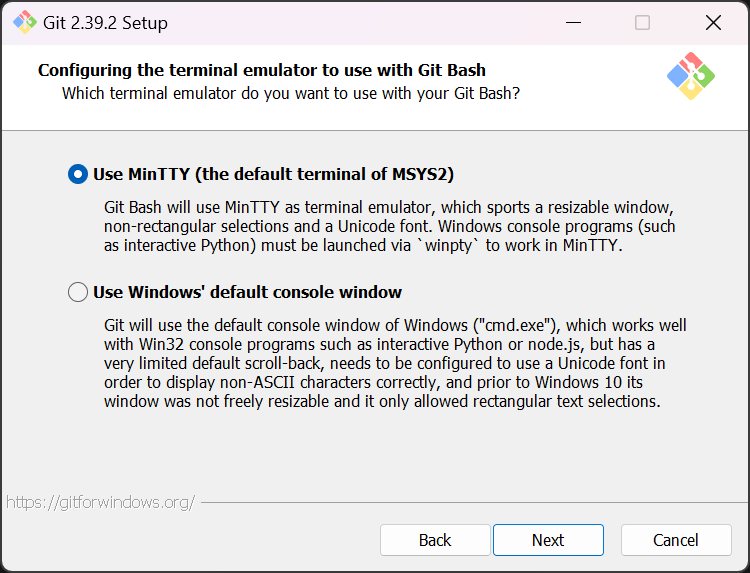

13. Untuk menjalankan, dari Start menu, ketikkan "Git", akan muncul beberapa pilihan. Pilih "Git Bash" atau "Git GUI".
 
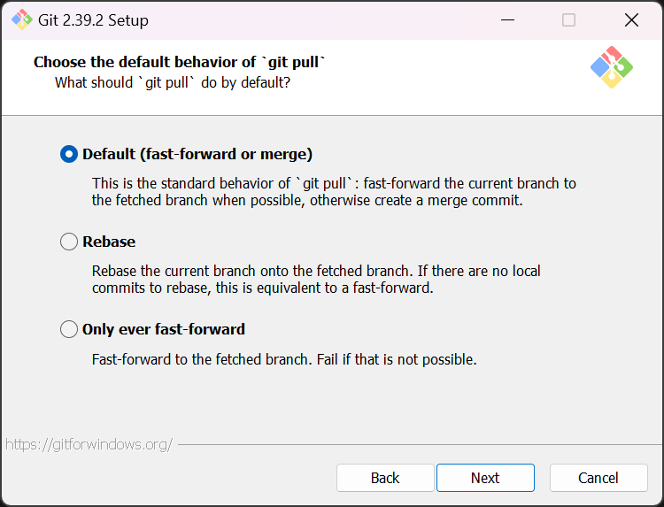

14. Tampilan jika akan menggunakan "Git Bash"

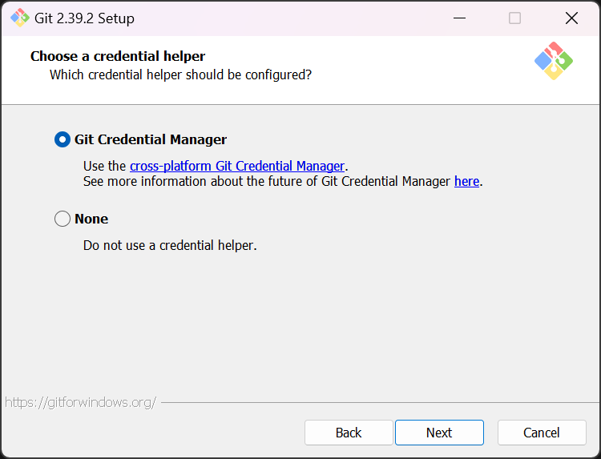

15. Tampilan jika akan menggunakan "Git GUI"

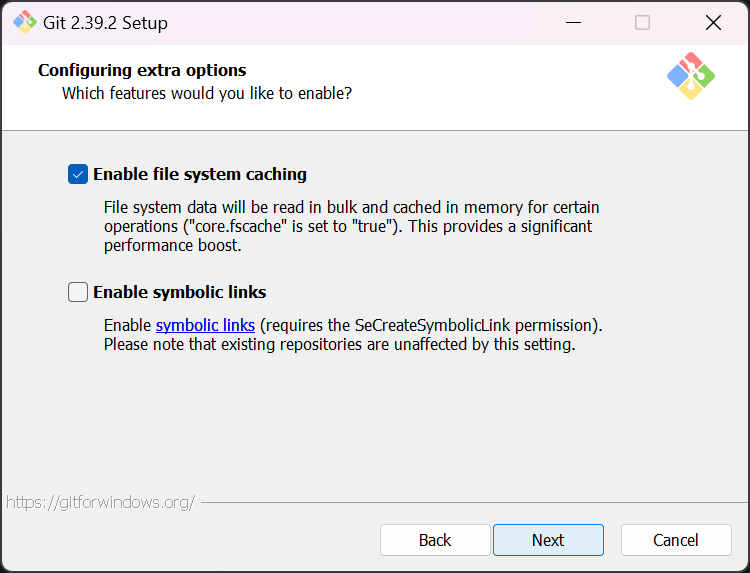

16. Untuk mencoba dari command prompt, masuk ke command prompt, setelah itu eksekusi "git --version" untuk melihat apakah sudah terinstall atau belum. Jika sudah terinstall dengan benar, makan akan muncul hasil berikut:

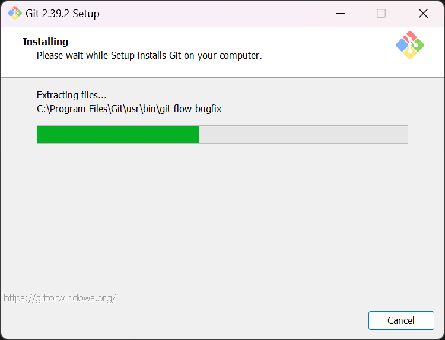
 
17. Untuk mencoba dari command prompt, masuk ke command prompt, setelah itu eksekusi "git --version" untuk melihat apakah sudah terinstall atau belum. Jika sudah terinstall dengan benar, makan akan muncul hasil berikut:

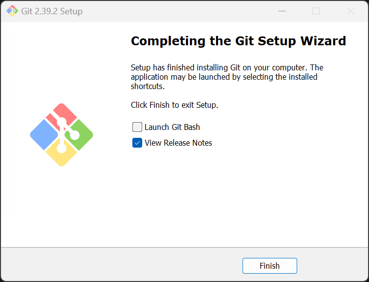

18. Untuk mencoba dari command prompt, masuk ke command prompt, setelah itu eksekusi "git --version" untuk melihat apakah sudah terinstall atau belum. Jika sudah terinstall dengan benar, makan akan muncul hasil berikut:


## 2. Konfigurasi awal yang harus dilakukan

Ada beberapa konfigurasi yang harus dupersiapakan sebelum mulai menggunakan Git, seperti name dan email.

Silahkan lakukan konfigurasi dengan perintah berikut ini :

```git config --global user.name "brayenbwnd06"
   git config --global user.email bwndbrayen06@gmail.com
```


Kemudian periksa konfigurasinya dengan perintah :

```git config --list```


## 3. Membuat Repository


