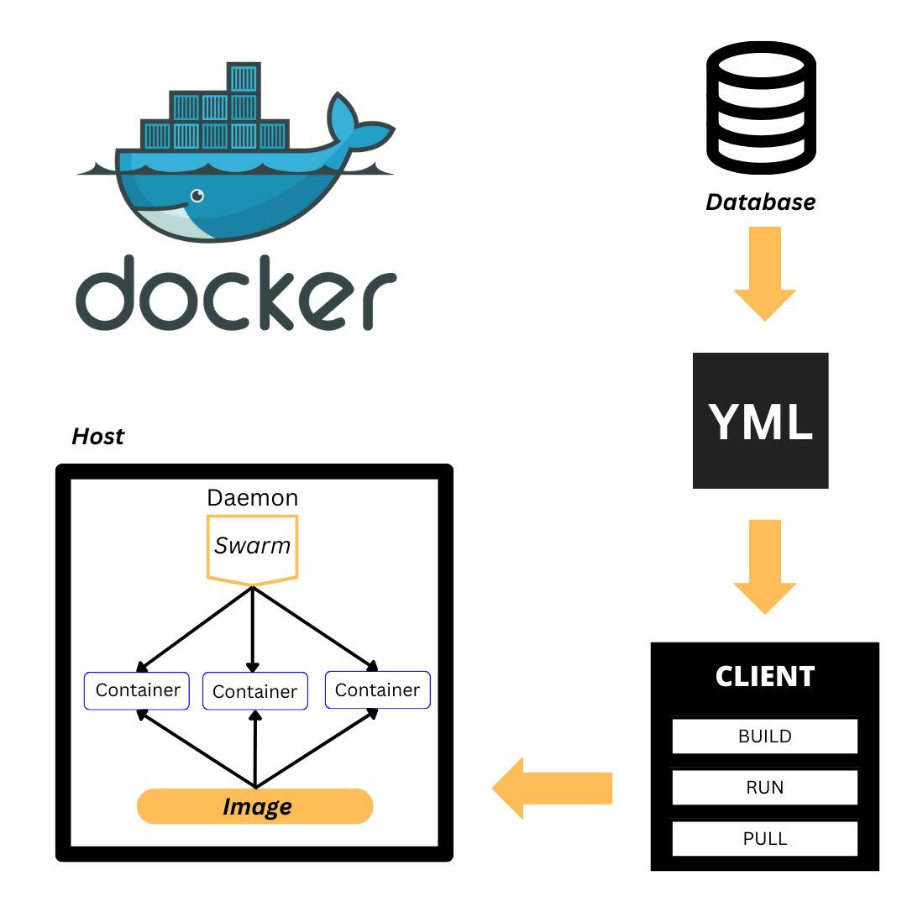

# Diagram - Docker Compose
adalah sebuah alat yang digunakan untuk mengelola dan menjalankan aplikasi yang terdiri dari beberapa layanan (services) yang berjalan dalam kontainer Docker. Dengan menggunakan Docker Compose, Anda dapat mendefinisikan dan mengkonfigurasi layanan apa saja yang diperlukan untuk menjalankan aplikasi Anda serta bagaimana layanan-layanan tersebut saling berinteraksi.

### Gambar Diagram : 

Docker compose memiliki tujuan agar dapat menjalankan multi-containers yang dapat disetting pada file yml, untuk dapat menjalankannya dapat melalui client dengan perintah-perintah yang ada lalu untuk mengatur dan mengelompokkan container tersebut juga dapat diatur dengan docker swarm output yang didapatkan berupa image. 

### Penjelasan tiap-tiap komponen : 
- Docker image : sebuah file yang terdiri dari beberapa lapisan (layers) yang saling terkait. Setiap lapisan mewakili perubahan yang dilakukan terhadap image dasar sebelumnya. Lapisan-lapisan ini dibangun secara bertahap saat Dockerfile, yang berisi instruksi-instruksi untuk membangun image, dieksekusi.
- Container: Container dapat membawa image tadi dan digunakan untuk membantu development. Satu Image dapat digunakan banyak Container.
- Dockerd: Yang Berisikan Images serta Container.
- docker client : Berfungsi untuk Menjalankan dan mengelola container, Membangun dan mengelola image, dan Mengelola Volume.
- Docker Compose: Digunakan untuk mengelola dan menjalankan aplikasi multi-container dengan menggunakan sebuah file konfigurasi YAML.
- Docker Swarm: Digunakan untuk mengelola dan menjalankan aplikasi yang terdiri dari beberapa kontainer di lingkungan Docker yang terdistribusi.

