# Docker Networking Hands-on Lab


### Langkah awal yang dilakukan yaitu login dengan menggunakan akun Docker

<div></div>


### Task

Section #1 - Networking Basics

Section #2 - Bridge Networking

Section #3 - Overlay Networking

Cleaning Up


## Bagian #1 - Networking Basics

### Langkah 1: Perintah Jaringan Docker
Perintah ```docker network``` adalah perintah utama untuk mengonfigurasi dan mengelola jaringan kontainer. Jalankan perintah ```docker network``` dari terminal pertama.
<div>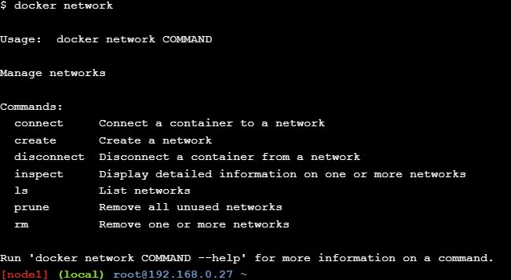</div>

### Langkah 2: Buat daftar jaringan
Jalankan perintah ```docker network ls``` untuk melihat jaringan kontainer yang ada di host Docker saat ini.
<div>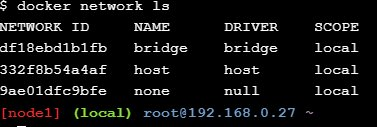</div><br>

### Langkah 3: Periksa jaringan
Perintah ```docker network inspect``` digunakan untuk melihat detail konfigurasi jaringan. Gunakan ```docker network inspect <network>``` untuk melihat detail konfigurasi jaringan kontainer di host Docker Anda. Perintah di bawah ini menunjukkan detail jaringan yang disebut ```bridge```.
<div>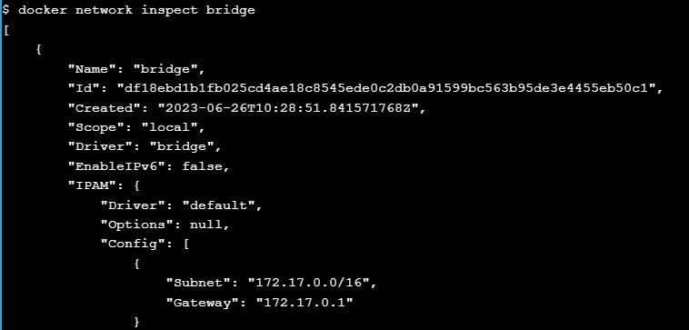</div><br>

### Langkah 4: Buat daftar plugin driver jaringan
Perintah ```docker info``` menampilkan banyak informasi menarik tentang instalasi Docker. Jalankan perintah ```docker info``` dan temukan daftar plugin jaringan.
<div>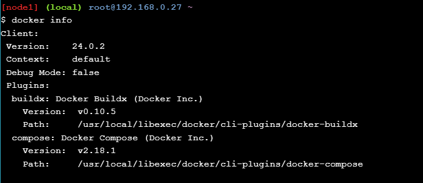</div><br>

## Bagian #2 - Jaringan Jembatan

### Langkah 1: Dasar-Dasar
Setiap instalasi Docker yang bersih dilengkapi dengan jaringan pra-bangun yang disebut jembatan. Verifikasi ini dengan docker ```network ls```.
<div>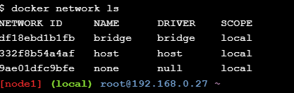</div><br>

Instal perintah ```brctl``` dan gunakan untuk mendaftar jembatan Linux di host Docker Anda. Anda dapat melakukannya dengan menjalankan ```sudo apt-get install bridge-utils```.
<div>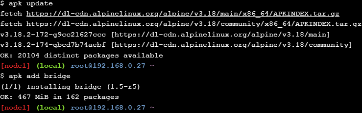</div><br>

<div>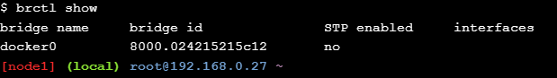</div><br>

Kemudian, daftarkan bridge pada host Docker Anda, dengan menjalankan ```brctl show```. Anda juga dapat menggunakan perintah ```ip a``` untuk melihat detail jembatan docker0.

<div>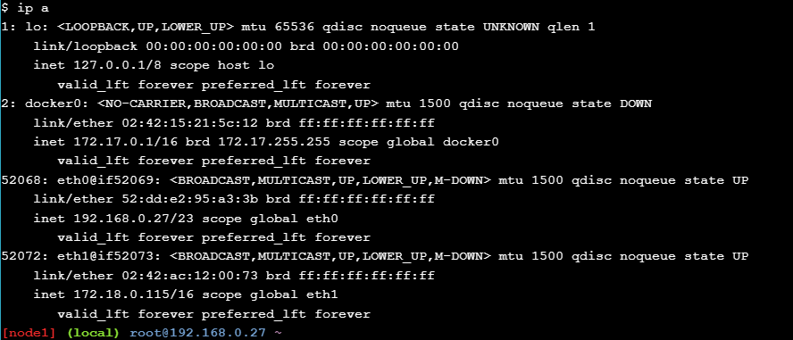</div><br>

### Langkah 2: Hubungkan wadah
Jaringan jembatan adalah jaringan default untuk kontainer baru. Ini berarti bahwa kecuali Anda menentukan jaringan yang berbeda, semua wadah baru akan terhubung ke jaringan penghubung. Buat wadah baru dengan menjalankan ```docker run -dt ubuntu sleep infinity```. Perintah ini akan membuat container baru berdasarkan image ```ubuntu:latest``` dan akan menjalankan perintah ```sleep``` agar container tetap berjalan di latar belakang. Anda dapat memverifikasi wadah contoh kami sudah aktif dengan menjalankan ```docker ps```.
<div>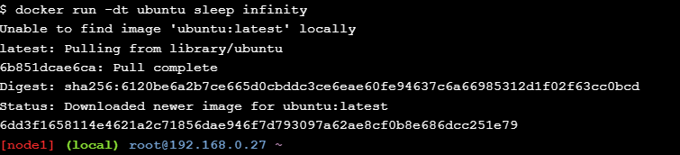</div><br>

<div>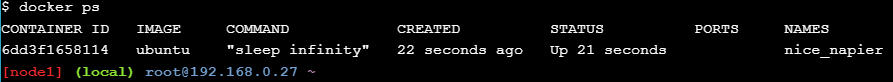</div><br>

Karena tidak ada jaringan yang ditentukan pada perintah ```docker run```, container akan ditambahkan ke jaringan bridge. Jalankan lagi perintah ```brctl show```. Perhatikan bagaimana jembatan docker0 sekarang memiliki antarmuka yang terhubung. Antarmuka ini menghubungkan jembatan docker0 ke wadah baru yang baru saja dibuat. Anda dapat memeriksa kembali jaringan bridge, dengan menjalankan ```docker network inspect bridge```, untuk melihat container baru yang terpasang padanya.
<div>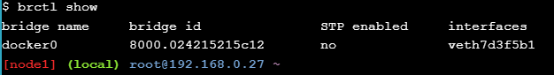</div><br>

<div>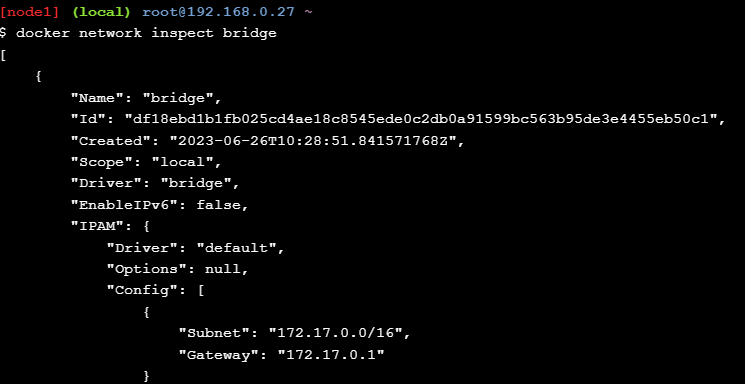</div><br>


### Langkah 3: Uji konektivitas jaringan
Ping alamat IP wadah dari prompt shell host Docker Anda dengan menjalankan ```ping -c5 <IPv4 Addre>```. Ingatlah untuk menggunakan IP wadah di lingkungan Anda.
<div>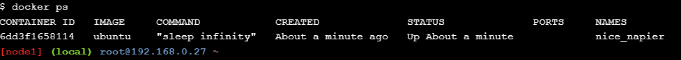</div><br>

Balasan di atas menunjukkan bahwa host Docker dapat melakukan ping ke container melalui jaringan bridge. Namun, kami juga dapat memverifikasi wadah tersebut dapat terhubung ke dunia luar juga. Mari masuk ke container, instal ```ping program```, lalu ping ```www.github.com```.

Pertama, kita perlu memulai ID container pada langkah sebelumnya. Anda dapat menjalankan ``docker ps`` untuk mendapatkannya. Selanjutnya, mari jalankan shell di dalam wadah ubuntu itu, dengan menjalankan ```docker exec -it <CONTAINER ID> /bin/bash```. Selanjutnya, kita perlu menginstal program ping. Jadi, mari jalankan ```apt-get update && apt-get install -y iputils-ping```.
<div>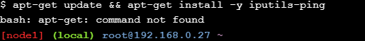</div><br>

Mari ping ```www.github.com``` dengan menjalankan ```ping -c5 www.github.com```. Terakhir, lepaskan shell kita dari container, dengan menjalankan ```exit```. Kita juga harus menghentikan penampung ini agar kita membersihkan semuanya dari pengujian ini, dengan menjalankan ```docker stop <CONTAINER ID>```.
<div>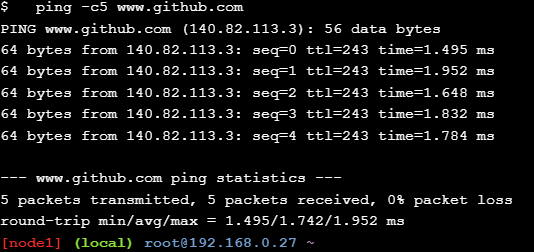</div><br>

### Langkah 4: Konfigurasikan NAT untuk konektivitas eksternal
Pada langkah ini kita akan memulai container NGINX baru dan memetakan port 8080 pada host Docker ke port 80 di dalam container. Ini berarti lalu lintas yang masuk ke host Docker di port 8080 akan dialirkan ke port 80 di dalam container.

Mulai wadah baru berdasarkan gambar NGINX resmi dengan menjalankan ```docker run --name web1 -d -p 8080:80 nginx```. Tinjau status container dan pemetaan port dengan menjalankan ```docker ps```.
<div>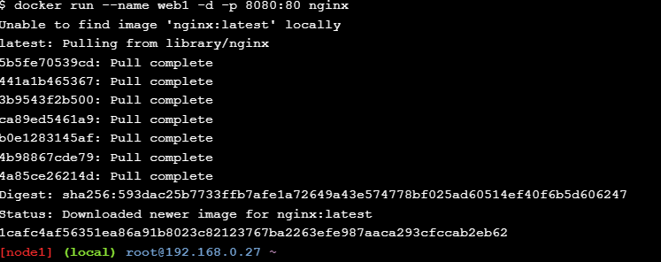</div><br>

Jika karena alasan tertentu Anda tidak dapat membuka seion dari browser web, Anda dapat terhubung dari host Docker Anda menggunakan perintah ```curl 127.0.0.1:8080```.
<div>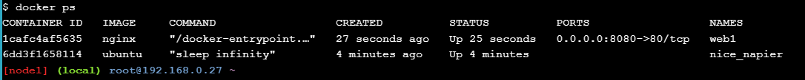</div><br>

<div>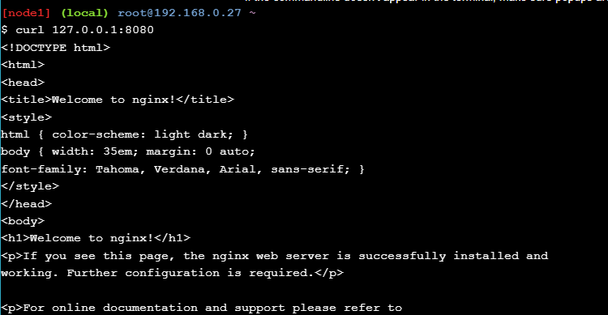</div><br>

## Bagian #3 - Jaringan Hamparan

### Langkah 1: Dasar-Dasar
Pada langkah ini Anda akan menginisialisasi Swarm baru, bergabung dengan satu node pekerja, dan memverifikasi bahwa operasi berhasil. Jalankan ```docker swarm init --advertise-addr $(hostname -i)```. Di terminal pertama, salin seluruh perintah ```docker swarm join ...``` yang ditampilkan sebagai bagian dari output dari output terminal Anda. Kemudian, rekatkan perintah yang disalin ke terminal kedua. Jalankan docker node ls untuk memverifikasi bahwa kedua node adalah bagian dari Swarm.
<div></div><br>

### Langkah 2: Buat jaringan overlay
Sekarang Anda memiliki Swarm yang diinisialisasi, saatnya membuat jaringan overlay. Buat jaringan overlay baru yang disebut "overnet" dengan menjalankan ```docker network create -d overlay overnet```. Gunakan perintah ```docker network ls``` untuk memverifikasi bahwa jaringan berhasil dibuat. Jalankan perintah ```docker network ls``` yang sama dari terminal kedua.
<div></div><br>
<div></div><br>

Perhatikan bahwa jaringan “overnet” tidak muncul dalam daftar. Ini karena Docker hanya memperluas jaringan overlay ke host saat dibutuhkan. Ini biasanya saat host menjalankan tugas dari layanan yang dibuat di jaringan. Kami akan melihat ini segera.

Gunakan perintah ```docker network inspect <network>``` untuk melihat informasi lebih rinci tentang jaringan "overnet". Anda harus menjalankan perintah ini dari terminal pertama.
<div></div><br>

### Langkah 3: Buat layanan
Sekarang kita memiliki Swarm yang diinisialisasi dan jaringan overlay, saatnya membuat layanan yang menggunakan jaringan.

Jalankan perintah berikut dari terminal pertama untuk membuat layanan baru bernama myservice di jaringan overnet dengan dua tugas/replika.

```
docker service create --name myservice \
--network overnet \
--replicas 2 \
ubuntu sleep infinity
```

Verifikasi bahwa layanan dibuat dan kedua replika aktif dengan menjalankan ```docker service ls```.
<div></div><br>

```2/2``` di kolom ```REPLIKAS``` menunjukkan bahwa kedua tugas dalam layanan aktif dan berjalan. Verifikasi bahwa satu tugas (replika) berjalan pada masing-masing dari dua node di Swarm dengan menjalankan ```docker service ps myservice```.
<div></div><br>

Kita juga dapat menjalankan ```docker network inspect overnet``` pada terminal kedua untuk mendapatkan informasi lebih rinci tentang jaringan "overnet" dan mendapatkan alamat IP dari tugas yang berjalan pada terminal kedua.
<div></div><br>

### Langkah 4: Uji jaringan
Untuk menyelesaikan langkah ini, Anda memerlukan alamat IP dari tugas layanan. Jalankan perintah berikut, ```docker network inspect overnet```. Perhatikan bahwa alamat IP yang tercantum untuk tugas layanan (kontainer) yang dijalankan pada node pertama berbeda dengan alamat IP untuk tugas layanan yang dijalankan pada node kedua. Perhatikan juga bahwa mereka berada di jaringan "overnet" yang sama.
<div></div><br>

Jalankan perintah ```docker ps``` untuk mendapatkan ID tugas layanan sehingga Anda dapat masuk ke langkah berikutnya. Masuk ke tugas layanan. Pastikan untuk menggunakan penampung ```ID``` dari lingkungan Anda karena akan berbeda dari contoh yang ditampilkan di bawah ini. Kita dapat melakukannya dengan menjalankan ```docker exec -it <CONTAINER ID> /bin/bash```. Instal perintah ping dan ping tugas layanan yang berjalan di kedua node.
<div></div><br>
<div></div><br>
Output di atas menunjukkan bahwa kedua tugas dari layanan myservice berada di jaringan overlay yang sama yang menjangkau kedua node dan mereka dapat menggunakan jaringan ini untuk berkomunikasi.

### Langkah 5: Uji penemuan layanan

Jalankan formulir ```cat /etc/resolv.conf``` di dalam container. Nilai yang kami minati adalah ```nameserver 127.0.0.11```. Nilai ini mengirim semua kueri DNS dari penampung ke penyelesai DNS tersemat yang berjalan di dalam penampung yang mendengarkan pada ```127.0.0.11:53```. Semua wadah Docker menjalankan server DNS tertanam di alamat ini. Coba dan ping nama "myservice" dari dalam container dengan menjalankan ```ping -c5 myservice```.
<div></div><br>

Ketik perintah ```exit``` untuk meninggalkan wadah ```exec``` dan kembali ke prompt shell host Docker Anda. Periksa konfigurasi layanan "myservice" dengan menjalankan ```docker service inspect myservice```. Mari kita verifikasi bahwa nilai VIP cocok dengan nilai yang dikembalikan oleh perintah ```ping -c5 myservice``` sebelumnya.
<div></div><br>

## Membersihkan
Jalankan perintah ```docker service rm myservice``` untuk menghapus layanan bernama myservice. Jalankan perintah ```docker ps``` untuk mendapatkan daftar container yang sedang berjalan. Anda dapat menggunakan perintah ```docker kill <CONTAINER ID ...>``` untuk mematikan wadah ubuntu dan nginx yang kita mulai di awal.
<div>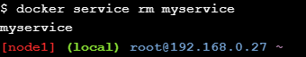</div><br>

Terakhir, mari hapus node1 dan node2 dari Swarm. Kita dapat menggunakan perintah ```docker swarm leave --force``` untuk melakukan itu.
<div>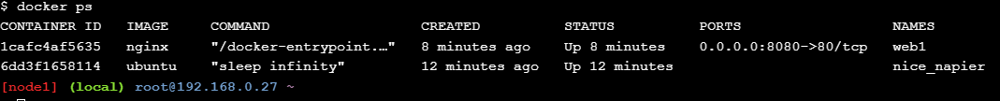</div>
<div>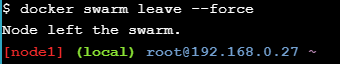</div>

