# Application Containerization and Microservice Orchestration

### Play with Docker classroom

### Langkah-langkah :
* Stage Setup
* Step 0: Basic Link Extractor Script
* Step 1: Containerized Link Extractor Script
* Step 2: Link Extractor Module with Full URI and Anchor Text
* Step 3: Link Extractor API Service
* Step 4: Link Extractor API and Web Front End Services
* Step 5: Redis Service for Caching
* Step 6: Swap Python API Service with Ruby
* Conclusions

### Stage Setup

Mari kita mulai dengan terlebih dahulu mengkloning repositori kode demo, mengubah direktori kerja, dan memeriksa cabangnya ```demo```

<div></div>

### Step 0: Basic Link Extractor Script

Periksa ```step0``` cabang dan daftar file di dalamnya

<div></div>


File tersebut ```linkextractor.py``` adalah yang menarik di sini, jadi mari kita lihat isinya: 

<div></div>


Ini adalah skrip Python sederhana yang mengimpor tiga paket: ```sys``` dari pustaka standar dan dua paket pihak ketiga populer ```requests``` dan ```bs4```. Argumen baris perintah yang disediakan pengguna (yang diharapkan berupa URL ke halaman HTML) digunakan untuk mengambil halaman menggunakan paket ```requests```, kemudian diuraikan menggunakan ```BeautifulSoup```. Objek yang diuraikan kemudian diulang untuk menemukan semua elemen jangkar (yaitu, ```<a>``` tag) dan mencetak nilai atributnya ```href``` yang berisi hyperlink.

Namun, skrip yang tampaknya sederhana ini mungkin bukan yang termudah untuk dijalankan pada mesin yang tidak memenuhi persyaratannya. File ```README.md``` menyarankan cara menjalankannya, jadi mari kita coba:

<div></div>


Saat kami mencoba menjalankannya sebagai skrip, kami mendapatkan kesalahan ```Permission denied```. Mari kita periksa izin saat ini pada file ini:

<div></div>


Izin saat ini ```.-rw-r--r--```. menunjukkan bahwa skrip tidak disetel untuk dapat dieksekusi. Kita dapat mengubahnya dengan menjalankan ```chmod``` ```a+x linkextractor.py``` atau menjalankannya sebagai program Python alih-alih skrip yang mengeksekusi sendiri seperti yang diilustrasikan di bawah ini:

<div></div>


### Step 1: Containerized Link Extractor Script

Periksa ```step1``` branh dan daftar file di dalamnya.

<div>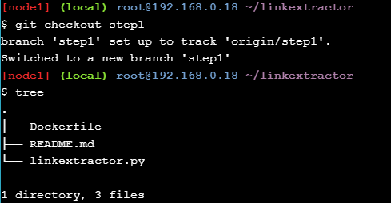</div>

Kami telah menambahkan satu file baru (yaitu, ```Dockerfile```) pada langkah ini. Mari kita lihat isinya:

<div>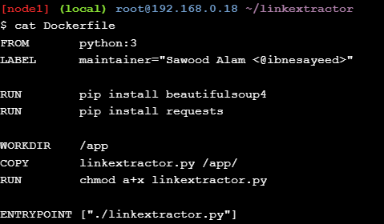</div>

Dengan menggunakan ini, ```Dockerfilekit```a dapat menyiapkan image Docker untuk skrip ini. Kita mulai dari image Docker resmi ```python``` yang berisi lingkungan run-time Python serta alat yang diperlukan untuk menginstal paket dan dependensi Python. Kami kemudian menambahkan beberapa metadata sebagai label (langkah ini tidak penting, tetapi tetap merupakan praktik yang baik). Dua instruksi berikutnya jalankan ```pip install``` perintah untuk menginstal dua paket pihak ketiga yang diperlukan agar skrip berfungsi dengan baik. Kami kemudian membuat direktori kerja ```/app```, menyalin ```linkextractor.py``` file di dalamnya, dan mengubah izinnya untuk menjadikannya skrip yang dapat dieksekusi. Terakhir, kami menetapkan skrip sebagai titik masuk untuk image.

Sejauh ini, kami baru saja menjelaskan bagaimana kami ingin image Docker kami, tetapi tidak benar-benar membangunnya. Jadi mari kita lakukan itu:

<div>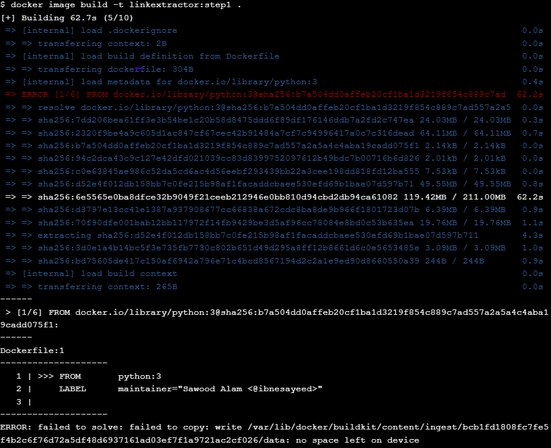</div>

Kami telah membuat gambar Docker yang diberi nama ```linkextractor:step1``` berdasarkan ```Dockerfile``` ilustrasi di atas. Jika build berhasil, kita seharusnya dapat melihatnya di daftar Image:

<div>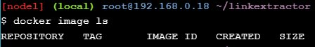</div>

Image ini harus memiliki semua bahan yang diperlukan yang dikemas di dalamnya untuk menjalankan skrip di mana saja pada mesin yang mendukung Docker. Sekarang, mari jalankan wadah satu kali dengan Image ini dan ekstrak tautan dari beberapa laman web langsung:

<div>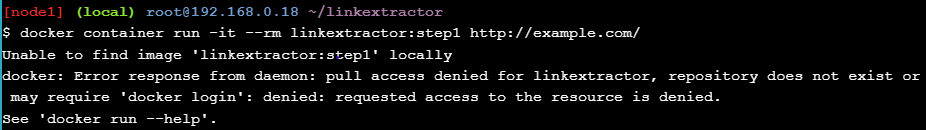</div>

Mari kita coba di halaman web dengan lebih banyak tautan di dalamnya:

<div>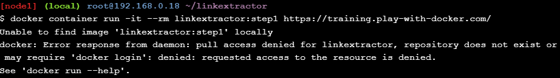</div>

### Step 2: Link Extractor Module with Full URI and Anchor Text

Periksa ```step2``` branch dan daftar file di dalamnya.

<div>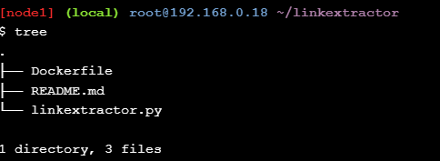</div>

Pada langkah ini ```linkextractor.py``` skrip diperbarui dengan perubahan fungsional berikut:

* Jalur dinormalisasi menjadi URL lengkap
* Melaporkan tautan dan teks jangkar
* Dapat digunakan sebagai modul dalam skrip lain
  
Mari kita lihat skrip yang diperbarui:

<div>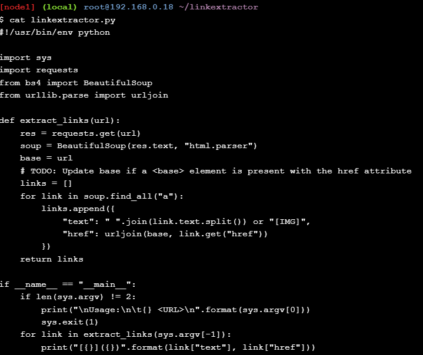</div>

Logika ekstraksi tautan diabstraksi menjadi fungsi ```extract_links ``` yang menerima URL sebagai parameter dan mengembalikan daftar objek yang berisi teks jangkar dan hyperlink yang dinormalisasi. Fungsionalitas ini sekarang dapat diimpor ke skrip lain sebagai modul (yang akan kita gunakan pada langkah berikutnya).

Sekarang, mari buat image baru dan lihat efek perubahan ini:

<div>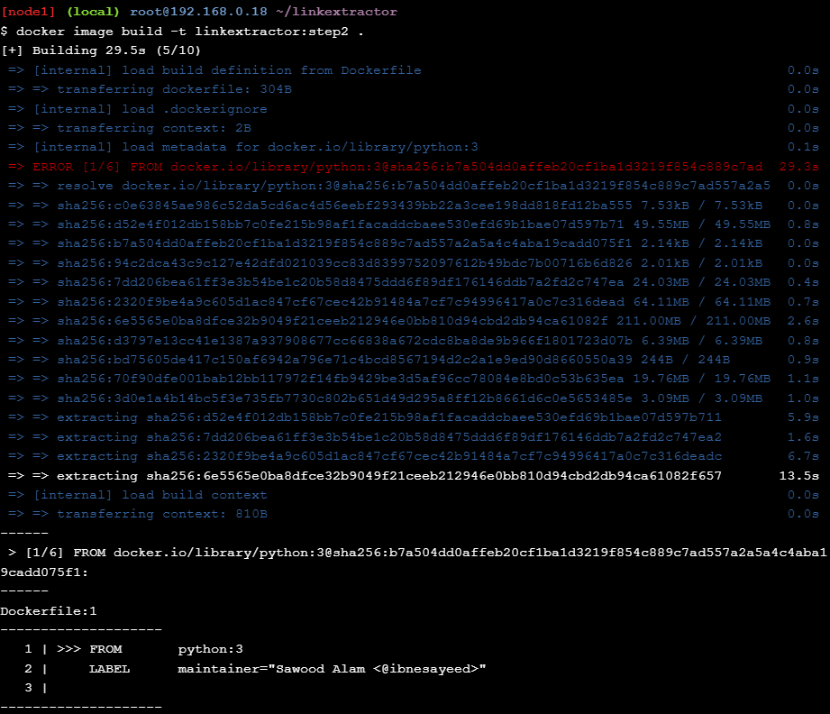</div>

Kami telah menggunakan tag baru ```linkextractor:step2``` untuk image ini sehingga kami tidak menimpa image dari untuk ```step1``` mengilustrasikan bahwa mereka dapat berdampingan dan penampung dapat dijalankan menggunakan salah satu dari image ini.

<div>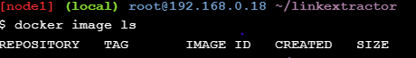</div>

Menjalankan Container satu kali menggunakan ```linkextractor:step2``` image sekarang akan menghasilkan keluaran yang lebih baik:

<div>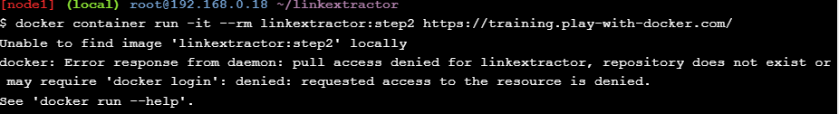</div>

Menjalankan Container menggunakan image sebelumnya ```linkextractor:step1``` harus tetap menghasilkan keluaran lama:

<div>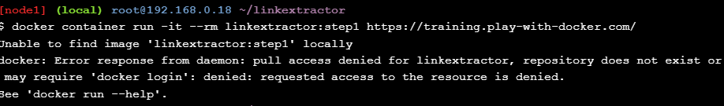</div>

### Step 3: Link Extractor API Service


### Step 4: Link Extractor API and Web Front End Services


### Step 5: Redis Service for Caching


### Step 6: Swap Python API Service with Ruby

### Kesimpulan 

Kami memulai tutorial ini dengan skrip Python sederhana yang menggores tautan dari URL halaman web tertentu. Kami mendemonstrasikan berbagai kesulitan dalam menjalankan skrip. Kami kemudian mengilustrasikan betapa mudahnya menjalankan dan membuat skrip menjadi portabel setelah dimasukkan ke dalam container. Pada langkah selanjutnya, kami secara bertahap mengembangkan skrip menjadi tumpukan aplikasi multi-layanan. Dalam prosesnya, kami menjelajahi berbagai konsep arsitektur layanan mikro dan bagaimana alat Docker dapat membantu dalam menyusun tumpukan multi-layanan. Terakhir, kami mendemonstrasikan kemudahan pertukaran komponen layanan mikro dan persistensi data.
