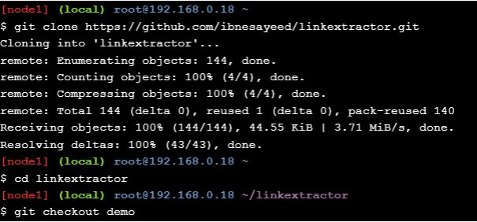

# Play with Docker classroom

## Application Containerization and Microservice Orchestration


### Steps:
* Stage Setup
* Step 0: Basic Link Extractor Script
* Step 1: Containerized Link Extractor Script
* Step 2: Link Extractor Module with Full URI and Anchor Text
* Step 3: Link Extractor API Service
* Step 4: Link Extractor API and Web Front End Services
* Step 5: Redis Service for Caching
* Step 6: Swap Python API Service with Ruby
* Conclusions

### Stage Setup

Mari kita mulai dengan terlebih dahulu mengkloning repositori kode demo, mengubah direktori kerja, dan memeriksa cabangnya ```demo```

<div></div>

### Step 0: Basic Link Extractor Script


### STEP-1


### STEP-2


### STEP-3


### STEP-4


### STEP-5


### STEP-6
