# Application Containerization and Microservice Orchestration

### Play with Docker classroom

### Langkah-langkah :
* Stage Setup
* Step 0: Basic Link Extractor Script
* Step 1: Containerized Link Extractor Script
* Step 2: Link Extractor Module with Full URI and Anchor Text
* Step 3: Link Extractor API Service
* Step 4: Link Extractor API and Web Front End Services
* Step 5: Redis Service for Caching
* Step 6: Swap Python API Service with Ruby
* Conclusions

### Stage Setup

Mari kita mulai dengan terlebih dahulu mengkloning repositori kode demo, mengubah direktori kerja, dan memeriksa cabangnya ```demo```

<div></div>

### Step 0: Basic Link Extractor Script

Periksa ```step0``` cabang dan daftar file di dalamnya

<div></div>


File tersebut ```linkextractor.py``` adalah yang menarik di sini, jadi mari kita lihat isinya: 

<div></div>


Ini adalah skrip Python sederhana yang mengimpor tiga paket: ```sys``` dari pustaka standar dan dua paket pihak ketiga populer ```requests``` dan ```bs4```. Argumen baris perintah yang disediakan pengguna (yang diharapkan berupa URL ke halaman HTML) digunakan untuk mengambil halaman menggunakan paket ```requests```, kemudian diuraikan menggunakan ```BeautifulSoup```. Objek yang diuraikan kemudian diulang untuk menemukan semua elemen jangkar (yaitu, ```<a>``` tag) dan mencetak nilai atributnya ```href``` yang berisi hyperlink.

Namun, skrip yang tampaknya sederhana ini mungkin bukan yang termudah untuk dijalankan pada mesin yang tidak memenuhi persyaratannya. File ```README.md``` menyarankan cara menjalankannya, jadi mari kita coba:

<div></div>


Saat kami mencoba menjalankannya sebagai skrip, kami mendapatkan kesalahan ```Permission denied```. Mari kita periksa izin saat ini pada file ini:

<div></div>


Izin saat ini ```.-rw-r--r--```. menunjukkan bahwa skrip tidak disetel untuk dapat dieksekusi. Kita dapat mengubahnya dengan menjalankan ```chmod``` ```a+x linkextractor.py``` atau menjalankannya sebagai program Python alih-alih skrip yang mengeksekusi sendiri seperti yang diilustrasikan di bawah ini:

<div></div>


### Step 1: Containerized Link Extractor Script

Periksa ```step1``` branh dan daftar file di dalamnya.

<div></div>

Kami telah menambahkan satu file baru (yaitu, ```Dockerfile```) pada langkah ini. Mari kita lihat isinya:

<div></div>

Dengan menggunakan ini, ```Dockerfilekit```a dapat menyiapkan image Docker untuk skrip ini. Kita mulai dari image Docker resmi ```python``` yang berisi lingkungan run-time Python serta alat yang diperlukan untuk menginstal paket dan dependensi Python. Kami kemudian menambahkan beberapa metadata sebagai label (langkah ini tidak penting, tetapi tetap merupakan praktik yang baik). Dua instruksi berikutnya jalankan ```pip install``` perintah untuk menginstal dua paket pihak ketiga yang diperlukan agar skrip berfungsi dengan baik. Kami kemudian membuat direktori kerja ```/app```, menyalin ```linkextractor.py``` file di dalamnya, dan mengubah izinnya untuk menjadikannya skrip yang dapat dieksekusi. Terakhir, kami menetapkan skrip sebagai titik masuk untuk image.

Sejauh ini, kami baru saja menjelaskan bagaimana kami ingin image Docker kami, tetapi tidak benar-benar membangunnya. Jadi mari kita lakukan itu:

<div></div>

Kami telah membuat gambar Docker yang diberi nama ```linkextractor:step1``` berdasarkan ```Dockerfile``` ilustrasi di atas. Jika build berhasil, kita seharusnya dapat melihatnya di daftar Image:

<div></div>

Image ini harus memiliki semua bahan yang diperlukan yang dikemas di dalamnya untuk menjalankan skrip di mana saja pada mesin yang mendukung Docker. Sekarang, mari jalankan wadah satu kali dengan Image ini dan ekstrak tautan dari beberapa laman web langsung:

<div></div>

Mari kita coba di halaman web dengan lebih banyak tautan di dalamnya:

<div></div>

### Step 2: Link Extractor Module with Full URI and Anchor Text

Periksa ```step2``` branch dan daftar file di dalamnya.

<div></div>

Pada langkah ini ```linkextractor.py``` skrip diperbarui dengan perubahan fungsional berikut:

* Jalur dinormalisasi menjadi URL lengkap
* Melaporkan tautan dan teks jangkar
* Dapat digunakan sebagai modul dalam skrip lain
  
Mari kita lihat skrip yang diperbarui:

<div></div>

Logika ekstraksi tautan diabstraksi menjadi fungsi ```extract_links ``` yang menerima URL sebagai parameter dan mengembalikan daftar objek yang berisi teks jangkar dan hyperlink yang dinormalisasi. Fungsionalitas ini sekarang dapat diimpor ke skrip lain sebagai modul (yang akan kita gunakan pada langkah berikutnya).

Sekarang, mari buat image baru dan lihat efek perubahan ini:

<div></div>

Kami telah menggunakan tag baru ```linkextractor:step2``` untuk image ini sehingga kami tidak menimpa image dari untuk ```step1``` mengilustrasikan bahwa mereka dapat berdampingan dan penampung dapat dijalankan menggunakan salah satu dari image ini.

<div></div>

Menjalankan Container satu kali menggunakan ```linkextractor:step2``` image sekarang akan menghasilkan keluaran yang lebih baik:

<div></div>

Menjalankan Container menggunakan image sebelumnya ```linkextractor:step1``` harus tetap menghasilkan keluaran lama:

<div></div>

### Step 3: Link Extractor API Service

Periksa ```step3``` branch dan daftar file di dalamnya.

<div>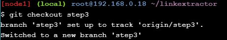</div>

<div>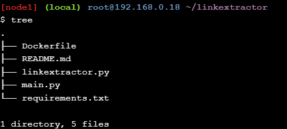</div>

Perubahan berikut telah dilakukan pada langkah ini:

* Menambahkan skrip server ```main.py``` yang menggunakan modul ekstraksi tautan yang ditulis di langkah terakhir
* The ```Dockerfile``` diperbarui untuk merujuk ke ```main.py``` file sebagai gantinya
* Server dapat diakses sebagai API WEB di ```http://<hostname>[:<prt>]/api/<url>```
* Dependensi dipindahkan ke ```requirements.txt``` file
* Membutuhkan pemetaan port agar layanan dapat diakses di luar container ( ```Flask``` server yang digunakan di sini mendengarkan 
  port ```5000``` secara default)
  
Pertama-tama mari kita lihat ```Dockerfile``` perubahannya:

<div>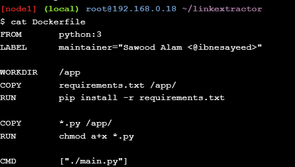</div>

Karena kita sudah mulai menggunakan ```requirements.txt``` untuk dependensi, kita tidak perlu lagi menjalankan ```pip install``` perintah untuk paket individual. Arahan ```ENTRYPOINT``` diganti dengan the ```CMD``` dan merujuk ke ```main.py``` skrip yang memiliki kode server karena kami tidak ingin menggunakan image ini untuk perintah satu kali sekarang.

Modul ```linkextractor.py``` tetap tidak berubah pada langkah ini, jadi mari kita lihat ```main.py``` file yang baru ditambahkan:

<div>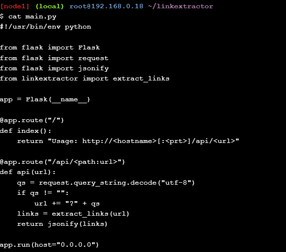</div>

Di sini, kami mengimpor ```extract_links``` fungsi dari ```linkextractor``` modul dan mengonversi daftar objek yang dikembalikan menjadi respons ```JSON```.

Saatnya membuat image baru dengan perubahan berikut:

<div>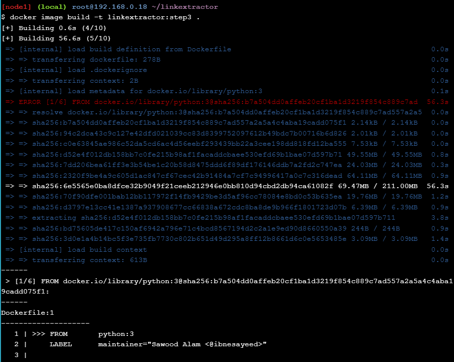</div>

Kemudian jalankan container dalam mode detached ( ```-d``` flag) sehingga terminal tersedia untuk perintah lain saat container masih berjalan. Perhatikan bahwa kita memetakan port ```5000``` container dengan ```5000``` host (menggunakan ```-p 5000:5000``` argumen) agar dapat diakses dari host. Kami juga menetapkan nama ( ```--name=linkextractor```) ke wadah agar lebih mudah melihat log dan membunuh atau menghapus wadah.

<div></div>

Jika semuanya berjalan dengan baik, kita seharusnya dapat melihat wadah yang terdaftar dalam ```Up``` kondisi:

<div>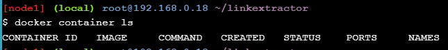</div>

Kami sekarang dapat membuat permintaan HTTP dalam bentuk ```/api/<url>```untuk berbicara dengan server ini dan mengambil respons yang berisi tautan yang diekstraksi:

<div>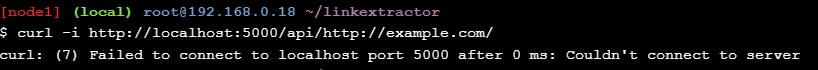</div>

Sekarang, kami menjalankan layanan API yang menerima permintaan dalam bentuk ```/api/<url>``` dan merespons dengan JSON yang berisi hyperlink dan teks jangkar dari semua tautan yang ada di halaman web di give >```<url>```

Karena penampung berjalan dalam mode terpisah, jadi kami tidak dapat melihat apa yang terjadi di dalam, tetapi kami dapat melihat log menggunakan nama yang  ```linkextractor``` kami tetapkan ke penampung kami:

<div>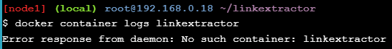</div>

### Step 4: Link Extractor API and Web Front End Services

Periksa ```step4``` branch dan daftar file di dalamnya.

<div>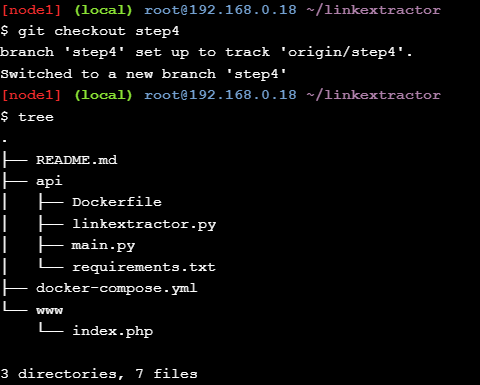</div>

Pada langkah ini, perubahan berikut telah dilakukan sejak langkah terakhir:

* Layanan JSON API ekstraktor tautan (ditulis dengan Python) dipindahkan ke ```./api``` folder terpisah yang memiliki kode yang sama persis seperti pada langkah sebelumnya
* Aplikasi front-end web ditulis dalam PHP di bawah ```./www``` folder yang berbicara dengan JSON API
* Aplikasi PHP dipasang di dalam ```php:7-apache``` image Docker resmi untuk modifikasi yang lebih mudah selama pengembangan
* Aplikasi web dibuat dapat diakses di ```http://<hostname>[:<prt>]/?url=<url-encoded-url>```
* Variabel lingkungan ```API_ENDPOINT``` digunakan di dalam aplikasi PHP untuk mengonfigurasinya agar berbicara dengan server API JSON
* Sebuah ```docker-compose.yml``` file ditulis untuk membangun berbagai komponen dan merekatkannya
  
Pada langkah ini kami berencana untuk menjalankan dua wadah terpisah, satu untuk API dan yang lainnya untuk antarmuka web. Yang terakhir membutuhkan cara untuk berbicara dengan server API. Agar kedua kontainer dapat berbicara satu sama lain, kita dapat memetakan port mereka di mesin host dan menggunakannya untuk perutean permintaan atau kita dapat menempatkan kontainer di satu jaringan pribadi dan mengaksesnya secara langsung. Docker memiliki dukungan luar biasa untuk jaringan dan memberikan perintah yang berguna untuk menangani jaringan. Selain itu, dalam wadah jaringan Docker mengidentifikasi diri mereka menggunakan nama mereka sebagai nama host untuk menghindari pencarian alamat IP mereka di jaringan pribadi. Namun, kami tidak akan melakukan semua ini secara manual, sebaliknya kami akan menggunakan Docker Compose untuk mengotomatiskan banyak tugas ini.

Jadi mari kita lihat ```docker-compose.yml``` file yang kita miliki:

<div>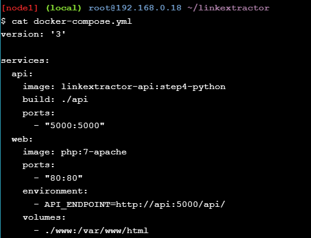</div>

Ini adalah file YAML sederhana yang menjelaskan dua layanan apidan web. Layanan ```api``` akan menggunakan ```linkextractor-api:step4-python``` image yang belum dibuat, tetapi akan dibuat berdasarkan permintaan menggunakan Dockerfiledari ./apidirektori. Layanan ini akan diekspos di port 5000host.

Layanan kedua bernama ```web``` akan menggunakan ```php:7-apache``` image resmi langsung dari DockerHub, itu sebabnya kami tidak memilikinya ```Dockerfile```. Layanan akan diekspos pada port HTTP default (yaitu, ```80```). Kami akan menyediakan variabel lingkungan yang diberi nama ```API_ENDPOINT``` dengan nilai ```http://api:5000/api/``` untuk memberi tahu skrip PHP ke mana harus terhubung untuk akses API. Perhatikan bahwa kami tidak menggunakan alamat IP di sini, melainkan ```api:5000``` digunakan karena kami akan memiliki entri nama host dinamis di jaringan pribadi untuk layanan API yang cocok dengan nama layanannya. Terakhir, kami akan mengikat mount ```./www``` folder untuk membuat ```index.php``` file tersedia di dalam ```web``` kontainer layanan di ```/var/www/html``` , yang merupakan root web default untuk server web Apache.

Sekarang, mari kita lihat ```www/index.php``` file yang dihadapi pengguna:

<div>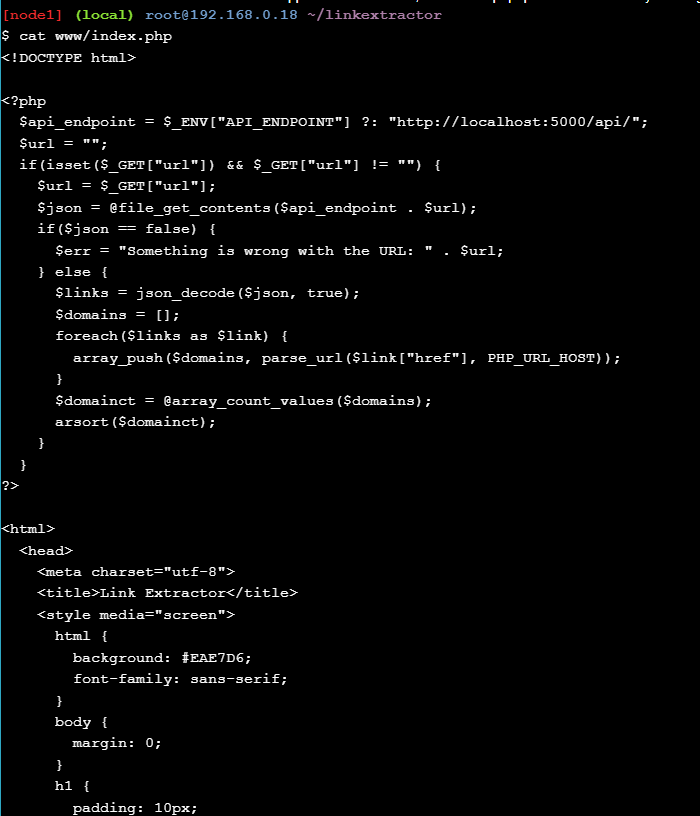</div>

Variabel ```$api_endpoint``` diinisialisasi dengan nilai variabel lingkungan yang disediakan dari ```docker-compose.yml``` file sebagai ```$_ENV["API_ENDPOINT"]```(jika tidak, kembali ke nilai default http://localhost:5000/api/). Permintaan dibuat menggunakan ```file_get_contents``` fungsi yang menggunakan $api_endpointvariabel dan URL yang disediakan pengguna dari ```$_GET["url"]```. Beberapa analisis dan transformasi dilakukan pada respons yang diterima yang nantinya digunakan dalam markup untuk mengisi halaman.

Mari tingkatkan layanan ini dalam mode terpisah menggunakan ```docker-compose``` utilitas:

<div></div>

Keluaran ini menunjukkan bahwa Docker Compose secara otomatis membuat jaringan bernama ```linkextractor_default```, menarik ```php:7-apache``` image dari DockerHub, membuat``` api:python``` image menggunakan lokal kami Dockerfile, dan terakhir, memutar dua wadah ```linkextractor_web_1``` dan ```linkextractor_api_1``` yang sesuai dengan dua layanan yang telah kami tentukan dalam file YAML di atas.

Memeriksa daftar wadah yang berjalan memastikan bahwa kedua layanan tersebut benar-benar berjalan:

<div>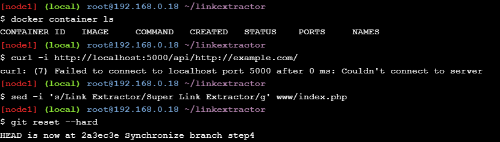</div>

Kita seharusnya sekarang dapat berbicara dengan layanan API seperti sebelumnya:

Untuk mengakses antarmuka web klik untuk membuka Link Extractor . Kemudian isi formulir dengan ```https://training.play-with-docker.com/``` (atau URL halaman HTML pilihan Anda) dan kirimkan untuk mengekstrak tautan darinya.

Kami baru saja membuat aplikasi dengan arsitektur layanan mikro, mengisolasi tugas individu dalam layanan terpisah sebagai kebalikan dari aplikasi monolitik di mana semuanya disatukan dalam satu unit. Aplikasi layanan mikro relatif lebih mudah untuk diskalakan, dipelihara, dan dipindahkan. Mereka juga memungkinkan pertukaran komponen yang mudah dengan layanan yang setara. Lebih lanjut tentang itu nanti.

Sekarang, mari kita ubah ```www/index.php``` file untuk mengganti semua kejadian Link Extractordengan Super Link Extractor:

Sebelum melanjutkan ke langkah berikutnya, kami perlu mematikan layanan ini, tetapi Docker Compose dapat membantu kami menanganinya dengan sangat mudah:

<div>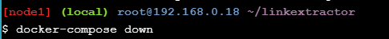</div>


### Step 5: Redis Service for Caching


### Step 6: Swap Python API Service with Ruby

### Kesimpulan 

Kami memulai tutorial ini dengan skrip Python sederhana yang menggores tautan dari URL halaman web tertentu. Kami mendemonstrasikan berbagai kesulitan dalam menjalankan skrip. Kami kemudian mengilustrasikan betapa mudahnya menjalankan dan membuat skrip menjadi portabel setelah dimasukkan ke dalam container. Pada langkah selanjutnya, kami secara bertahap mengembangkan skrip menjadi tumpukan aplikasi multi-layanan. Dalam prosesnya, kami menjelajahi berbagai konsep arsitektur layanan mikro dan bagaimana alat Docker dapat membantu dalam menyusun tumpukan multi-layanan. Terakhir, kami mendemonstrasikan kemudahan pertukaran komponen layanan mikro dan persistensi data.
