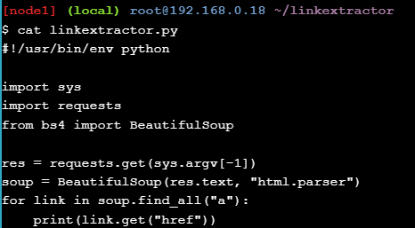

# Application Containerization and Microservice Orchestration

### Play with Docker classroom

### Steps:
* Stage Setup
* Step 0: Basic Link Extractor Script
* Step 1: Containerized Link Extractor Script
* Step 2: Link Extractor Module with Full URI and Anchor Text
* Step 3: Link Extractor API Service
* Step 4: Link Extractor API and Web Front End Services
* Step 5: Redis Service for Caching
* Step 6: Swap Python API Service with Ruby
* Conclusions

### Stage Setup

Mari kita mulai dengan terlebih dahulu mengkloning repositori kode demo, mengubah direktori kerja, dan memeriksa cabangnya ```demo```

<div></div>

### Step 0: Basic Link Extractor Script

Periksa ```step0``` cabang dan daftar file di dalamnya

<div></div>

File tersebut ```linkextractor.py``` adalah yang menarik di sini, jadi mari kita lihat isinya: 

<div></div>

Ini adalah skrip Python sederhana yang mengimpor tiga paket: ```sys``` dari pustaka standar dan dua paket pihak ketiga populer ```requests``` dan ```bs4```. Argumen baris perintah yang disediakan pengguna (yang diharapkan berupa URL ke halaman HTML) digunakan untuk mengambil halaman menggunakan paket ```requests```, kemudian diuraikan menggunakan ```BeautifulSoup```. Objek yang diuraikan kemudian diulang untuk menemukan semua elemen jangkar (yaitu, ```<a>``` tag) dan mencetak nilai atributnya ```href``` yang berisi hyperlink.

Namun, skrip yang tampaknya sederhana ini mungkin bukan yang termudah untuk dijalankan pada mesin yang tidak memenuhi persyaratannya. File ```README.md``` menyarankan cara menjalankannya, jadi mari kita coba:

<div></div>

Saat kami mencoba menjalankannya sebagai skrip, kami mendapatkan kesalahan ```Permission denied```. Mari kita periksa izin saat ini pada file ini:

<div></div>

Izin saat ini ```.-rw-r--r--```. menunjukkan bahwa skrip tidak disetel untuk dapat dieksekusi. Kita dapat mengubahnya dengan menjalankan ```chmod``` ```a+x linkextractor.py``` atau menjalankannya sebagai program Python alih-alih skrip yang mengeksekusi sendiri seperti yang diilustrasikan di bawah ini:

<div></div>

### Step 1: Containerized Link Extractor Script


### Step 2: Link Extractor Module with Full URI and Anchor Text


### Step 3: Link Extractor API Service


### Step 4: Link Extractor API and Web Front End Services


### Step 5: Redis Service for Caching


### Step 6: Swap Python API Service with Ruby

### Kesimpulan 

Kami memulai tutorial ini dengan skrip Python sederhana yang menggores tautan dari URL halaman web tertentu. Kami mendemonstrasikan berbagai kesulitan dalam menjalankan skrip. Kami kemudian mengilustrasikan betapa mudahnya menjalankan dan membuat skrip menjadi portabel setelah dimasukkan ke dalam container. Pada langkah selanjutnya, kami secara bertahap mengembangkan skrip menjadi tumpukan aplikasi multi-layanan. Dalam prosesnya, kami menjelajahi berbagai konsep arsitektur layanan mikro dan bagaimana alat Docker dapat membantu dalam menyusun tumpukan multi-layanan. Terakhir, kami mendemonstrasikan kemudahan pertukaran komponen layanan mikro dan persistensi data.
