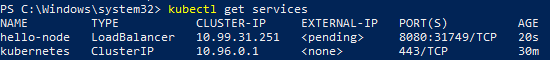
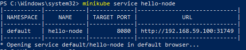
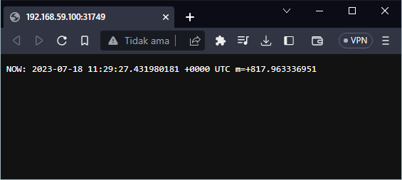
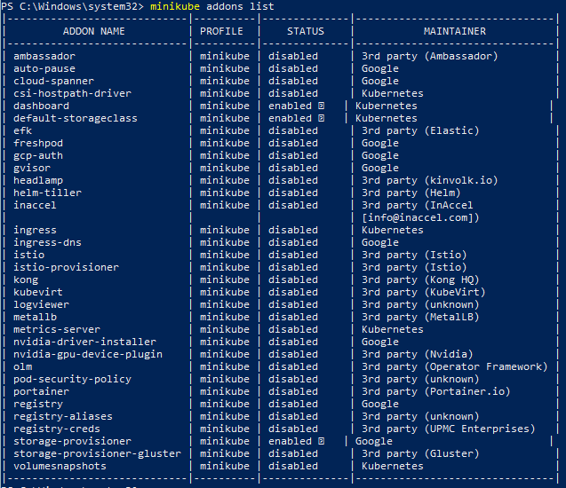
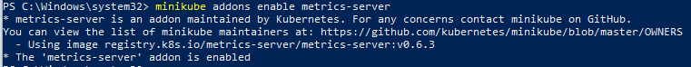
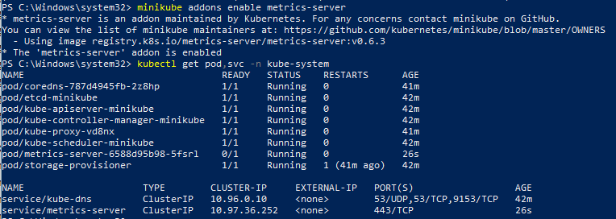
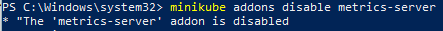
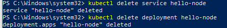
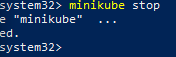

# Kubernetes Intro - Hello Minikube

## Hello Minikube

Tutorial ini menunjukkan cara menjalankan aplikasi sampel di Kubernetes menggunakan minikube. Tutorial menyediakan image container yang menggunakan NGINX untuk menggemakan kembali semua permintaan.

### Tujuan
 * Men-deploy aplikasi sampel ke minikube
 * Jalankan aplikasi
 * Lihat log aplikasi

#### 1. Sebelum memulai,  pastikan bahwa ```minikube``` dan ```kubectl``` sudah terinstal. Jika belum maka perlu menginstall terlebih dahulu

   <div></div>
   <div></div>

#### 2. Langkah awal yaitu membuat ```Kluster Minikube``` dengan menggunakan perintah ```minikube start```

   <div></div>
     
#### 3. Selanjutnya buka terminal baru  dan masukan perintah ```minikube dahsboard``` untuk membuka Dashboard minikube

   <div></div>
   <div></div>
   
#### 4. Membuat Penerapan
   ```Pod``` Kubernetes adalah grup dari satu atau lebih Container, yang diikat menjadi satu untuk tujuan administrasi dan jaringan. Pod dalam tutorial ini hanya memiliki satu Container. Deployment Kubernetes memeriksa 
    kesehatan Pod Anda dan memulai ulang Container Pod jika dihentikan. Deployment adalah cara yang disarankan untuk mengelola pembuatan dan penskalaan Pod.

   1. Gunakan ```kubectl create``` perintah untuk membuat Deployment yang mengelola Pod. Pod menjalankan Container berdasarkan gambar Docker yang disediakan. dengan menggunakan perintah ```kubectl create deployment hello-node -- 
     image=registry.k8s.io/e2e-test-images/agnhost:2.39 -- /agnhost netexec --http-port=8080```
     
      <div></div>
      
   2. Lihat Penerapan dengan menggunakan perintah ```kubectl get deployments```

      <div></div>
      
   3. Lihat Pod dengan menggunakan perintah ```kubectl get pods```
  
      <div></div>
     
   4. Lihat peristiwa kluster dengan menggunakan perintah ```kubectl get events```
  
      <div></div>

     
   5. Lihat ```kubectl``` konfigurasi dengan menggunakan perintah ```kubectl config view```
  
      <div></div>

#### 5. Membuat Layanan
   Secara default, Pod hanya dapat diakses melalui alamat IP internalnya di dalam kluster Kubernetes. Agar hello-nodeContainer dapat diakses dari luar jaringan virtual Kubernetes, Anda harus mengekspos Pod sebagai 
   Layanan Kubernetes

   1. Paparkan Pod ke internet publik menggunakan ```kubectl expose``` perintah: ```kubectl expose deployment hello-node --type=LoadBalancer --port=8080```

      <div></div>

      Bendera ```--type=LoadBalancer``` menunjukkan bahwa Anda ingin mengekspos Layanan Anda di luar cluster.

      Kode aplikasi di dalam gambar uji hanya mendengarkan pada TCP port 8080. Jika Anda menggunakan ```kubectl expose``` port yang berbeda, klien tidak dapat terhubung ke port lain tersebut.

   2. Lihat Layanan yang Anda buat: dengan menggunakan perintah ```kubectl get services```
  
       <div></div>
  
      Pada penyedia cloud yang mendukung penyeimbang muatan, alamat IP eksternal akan disediakan untuk mengakses Layanan. Di minikube, ```LoadBalancer``` tipe tersebut membuat Layanan dapat diakses melalui ```minikube service``` perintah.
      
   3. Jalankan perintah berikut: ```minikube service hello-node```
  
      <div></div>
      <div></div>
#### 6. Aktifkan Add-on
   Alat minikube menyertakan satu set built-inaddonsyang dapat diaktifkan, dinonaktifkan, dan dibuka di lingkungan Kubernetes lokal.

   1. Buat daftar add-on yang saat ini didukung: dengan perintah ```minikube addons list```

      <div></div>

      
   2. Aktifkan addon, misalnya ```metrics-server``` : dengan perintah ```minikube addons enable metrics-server```

      <div></div>
      
   3. Lihat Pod dan Layanan yang Anda buat dengan menginstal addon itu: dengan perintah ```kubectl get pod,svc -n kube-system```

      <div></div>
      
   4. Nonaktifkan ```metrics-server```: dengan perintah ```minikube addons disable metrics-server```

      <div></div>

      
#### 6. Membersikan

Sekarang Anda dapat membersihkan sumber daya yang Anda buat di klaster Anda: dengan perintah

```
kubectl delete service hello-node
kubectl delete deployment hello-node
```

  <div></div>

Hentikan kluster Minikube dengan perintah ```minikube stop```

  <div></div>

Secara opsional, hapus VM Minikube: dengan perintah ```minikube delete```


